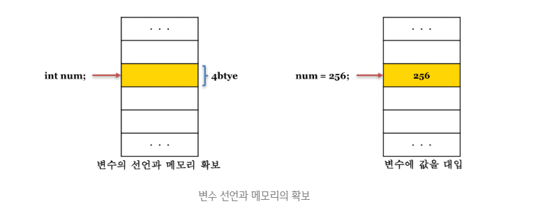

# 변수와 데이터 타입 정리

변수는 값의 위치(주소)를 기억하는 저장소입니다.  
값을 저장하려면 먼저 메모리 공간을 확보해야 하며, 이때 필요한 메모리 크기는 **데이터 타입(Data Type)**에 따라 달라집니다.  
데이터 타입은 저장할 값의 종류를 의미합니다.



---

## 1. 데이터 타입

**원시 타입**과 **객체 타입**으로 나뉩니다.

| 구분          | 타입            | 설명                                          | 예시                                |
| ------------- | --------------- | --------------------------------------------- | ----------------------------------- |
| **원시 타입** | 숫자 (number)   | 숫자 (정수, 실수, NaN, Infinity 포함)         | `10`, `3.14`, `NaN`                 |
|               | 문자 (string)   | 문자열 (텍스트 데이터)                        | `"hello"`, `'안녕'`, `` `템플릿` `` |
|               | Boolean         | 논리형                                        | `true`, `false`                     |
|               | undefined       | 값이 할당되지 않은 변수의 초기값              | `let x; // undefined`               |
|               | null            | 의도적으로 "값 없음"                          | `let y = null;`                     |
|               | Symbol (ES6)    | 유일무이한 값 (주로 객체 프로퍼티 key로 사용) | `Symbol('id')`                      |
| **객체 타입** | Object          | 키-값 쌍의 집합                               | `{ name: "heo", age: 20 }`          |
|               | Array           | 순서 있는 리스트                              | `[1, 2, 3]`                         |
|               | Function        | 함수도 객체                                   | `function add(x,y){ return x+y }`   |
|               | Date, RegExp 등 | 내장 객체들                                   | `new Date()`, `/[a-z]+/g`           |

---

### 📌 number (숫자 타입)

자바스크립트는 **64비트 부동소수점** 형식을 사용합니다.

```javascript
var integer = 10; // 정수
var double = 10.12; // 실수
var negative = -20; // 음의 정수
var binary = 0b01000001; // 2진수
var octal = 0o101; // 8진수
var hex = 0x41; // 16진수
```

===NaN===, ===Infinity===, ===-Infinity===도 모두 ===number=== 타입입니다;

```
var pInf = 10 / 0;
console.log(pInf); // Infinity

var nInf = 10 / -0;
console.log(nInf); // -Infinity

var nan = 1 * "string";
console.log(nan); // NaN
```

hr

### string (문자열)

자바스크립트 문자열은 원시 타입이며 **불변(immutable)**입니다.

```
var str = "string";      // 큰 따옴표
str = 'string';          // 작은 따옴표
str = `string`;          // 백틱 (템플릿 리터럴)

str = "큰 따옴표 내 '작은 따옴표'";
str = '작은 따옴표 내 "큰 따옴표"';
```

문자열은 재할당은 가능하지만 원래 문자열 자체는 수정 불가능합니다.
hr

### boolean (불리언)

논리적 참/거짓을 나타냅니다.

```
var isTrue = true;
var isFalse = false;
```

===null===, ===undefined===, ===0===, ===NaN===, ===""=== (빈 문자열) → false로 평가됨

### undefined

값이 **_할당되지 않은 변수_**에 접근하면 반환되는 값입니다.

```
var foo;
console.log(foo); // undefined
```

===undefined===는 자바스크립트 엔진이 자동으로 할당하는 값이며, 직접 사용하는 것은 권장되지 않습니다.

### null

```
var foo = 'Lee';
foo = null; // 참조 제거
```

===null===은 **명시적으로 “비어 있음”을 나타냄**
더 이상 사용되지 않는 메모리는 자바스크립트 엔진이 **가비지 콜렉션(GC)**으로 정리

### 변수 선언

```
var a;
let b;
const c = 1;
```

### 변수의 중복 선언

===var===는 중복 선언 가능하지만 ===let===, ===const===는 불가능

```
var x = 1;
var x = 2; // 가능

let y = 1;
// let y = 2; // 오류
```

### 동적 타이핑 (Dynamic Typing)

자바스크립트는 **타입이 고정되지 않고**런타임 중에 변경될 수 있습니다.

```
let value = 10;
console.log(typeof value); // "number"

value = "hello";
console.log(typeof value); // "string"

value = true;
console.log(typeof value); // "boolean"
```

### 변수 호이스팅 (Variable Hoisting)

===var===로 선언된 변수는 선언이 **끌어올려짐(hoisting).**

```
console.log(x); // undefined
var x = 5;
```
