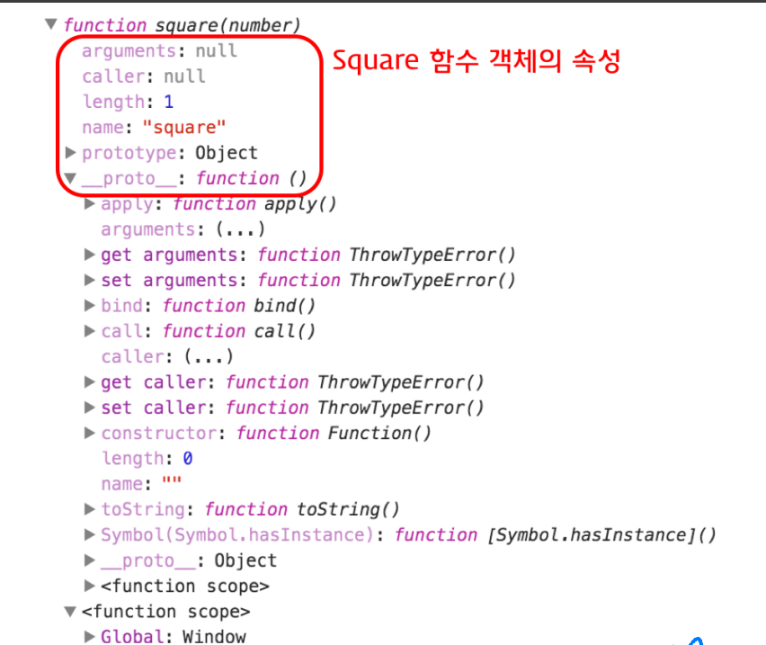

함수란 특정 작업을 수행하는 문(statement)들의 집합을 정의한 코드 블록입니다.  
함수는 이름과 매개변수를 가지고 필요할 때 호출하여 실행할 수 있습니다.

자바스크립트 함수는 **일급 객체(First-class object)**  
- 변수, 객체, 배열 등에 저장 가능  
- 다른 함수의 인수로 전달 가능  
- 반환값으로 사용 가능  

---

## 1. 함수의 일반적 기능
- 코드 재사용  
- 객체 생성  
- 객체의 행위 정의(메소드)  
- 정보 은닉  
- 클로저  
- 모듈화  

---

## 2. 함수 정의 방식

### 2.1 함수 선언문
- 이름 필수  
- 매개변수 0개 이상  
- **호이스팅 가능** (선언 이전 호출 가능)

```js
function square(number) {
  return number * number;
}
console.log(square(3)); // 9


## 2.2 함수 표현식(Function Expression)

- 익명 함수 가능  
- 변수, 객체, 배열에 저장 가능  
- **호이스팅 제한**: 할당 이전 호출 불가

```js
var square = function(number) {
  return number * number;
};
console.log(square(4)); // 16

## 2.3 Function 생성자

- 동적으로 함수 생성 가능  
- 일반적으로 잘 사용하지 않음

```js
var square = new Function('number', 'return number * number');
console.log(square(5)); // 25

## 3. 매개변수와 인수

- **Parameter**: 함수 정의 시 선언된 변수  
- **Argument**: 실제 전달되는 값  

- 원시 값 → **Call-by-value**  
- 객체 → **Call-by-reference**

```js
function changeVal(num, obj) {
  num += 100;
  obj.name = 'Kim';
}

var x = 100;
var person = { name: 'Lee' };

changeVal(x, person);

console.log(x);      // 100
console.log(person); // { name: 'Kim' }
```

## 4. 함수 형태
 **즉시 실행 함수 (IIFE)**
```js
(function() {
  console.log('즉시 실행');
})();


 **내부 함수 (Inner Function)**
```js
function outer() {
  function inner() {
    console.log('내부 함수');
  }
  inner();
}
outer();

 **재귀 함수 (Recursive Function)**
```js
function factorial(n) {
  if (n <= 1) return 1;
  return n * factorial(n-1);
}

console.log(factorial(5)); // 120

**재귀 함수 (Recursive Function)**
```js
function factorial(n) {
  if (n <= 1) return 1;
  return n * factorial(n-1);
}

console.log(factorial(5)); // 120


5. 함수 객체 프로퍼티

arguments: 전달된 인수 확인 가능

caller: 자신을 호출한 함수

length: 정의된 매개변수 개수

name: 함수 이름

prototype: 생성자 함수일 때 인스턴스 프로토타입 지정